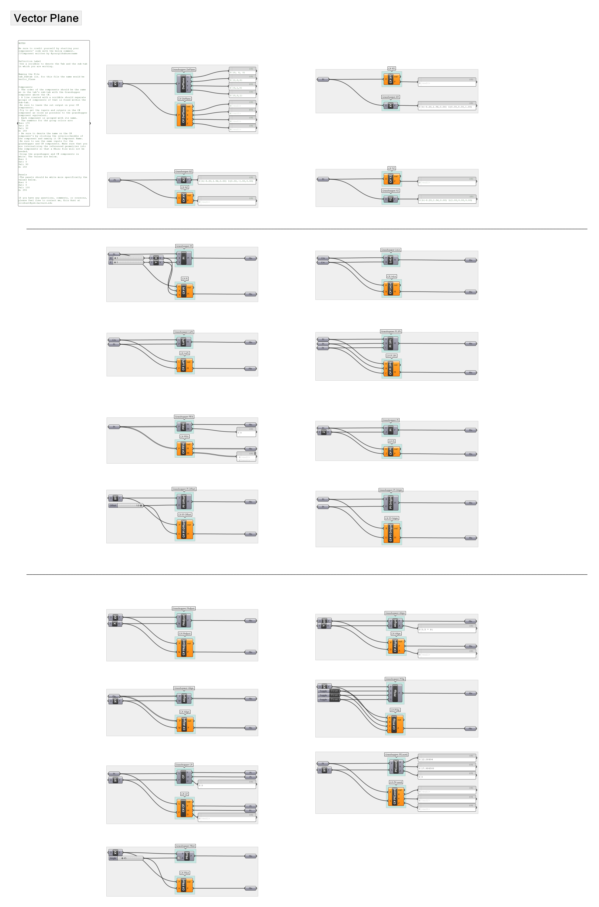

Good evening, everyone,

I have attached a Grasshopper template for how we discussed laying out our files. For this example file I have used the tab Vector and the sub-tab Plane shown in the image below.

In the Grasshopper file the components are oriented in a similar fashion to how they are displayed in the tabs with the original grasshopper component on top and the C# equivalent below. I included a number of notes in the panel at left regarding colors and other necessary information but I could be missing something. Please feel free to reach out if you have any comments, concerns, or questions about formatting.

Best,

Erin Linsey Hunt
Master in Design Studies Technology Candidate
Harvard Graduate School of Design

erinlhunt.com
